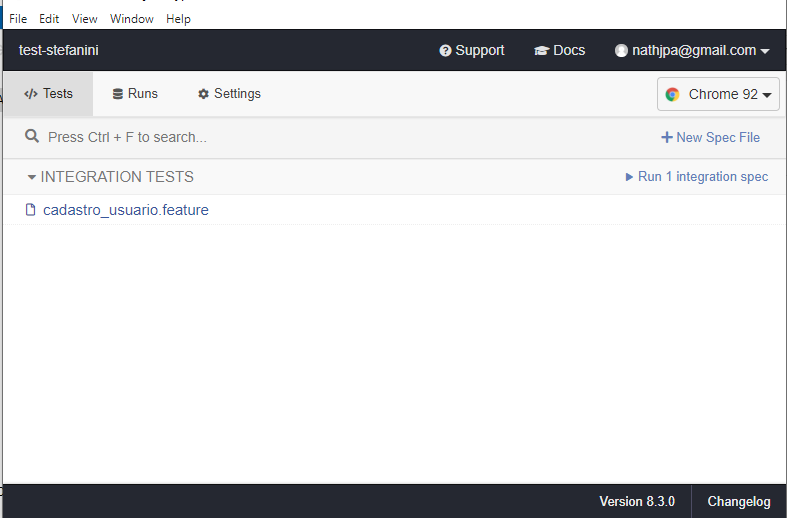
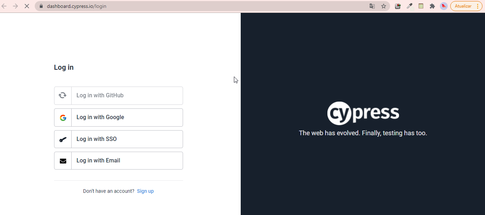

### Instalação:

`npm install`

### Executar o projeto no terminal:

`npm run test`

### Executar o projeto no navegador do cypress:

`npm run cy:open`
#### Após rodar esse comando deverá aparecer a tela abaixo:

Clique no teste cadastro_usuario.feature

### Após rodar os teste com sucesso deverá aparecer a tela abaixo:

### Executar o projeto para acessar o dashboard através da URL gerada:
`npm run cypress run dash`

#### Copiar URL gerada e realizar login através da tela abaixo:

#### Dashboard:

Tela do dashboard apresenta uma visão geral dos testes (via html), tempo de execução da feature e etc

#### Aba Test Results:

Nesta opção é possível verificar cenário a cenário, com seus respectivos vídeos e screenshots.

